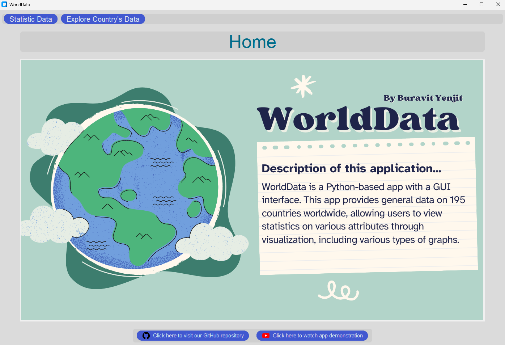

# WorldData
  WorldData is a Python-based app with a GUI interface. This app provides general data on 195 countries worldwide, allowing users to view statistics on various attributes through visualization, including various types of graphs.
Here's some GUI in this application, see more in [Wiki](https://github.com/KikyoBRV/WorldData/wiki).



## Data Source
This project using [Global Country Information Dataset 2023](https://www.kaggle.com/datasets/nelgiriyewithana/countries-of-the-world-2023/data) as a data source.
(This data has some errors, such as errors in country names, but I have already fixed them. Additionally, I have added the region of each country to the data.)

## Graph Algorithm
In the graph modeling section, my aim is to enable users to find the shortest path between the capital cities of countries they have selected. This graph allows users to set the maximum distance between country thresholds, the system provides the flexibility to adjust the level of connectivity in the graph. This enables users to explore different scenarios and find the most optimal routes based on their specific requirements.
[Here](https://docs.google.com/document/d/1VWeGzTTCVUpvB0t_nb6r9zAssKcxtrMT3xJ0vG9MQrc/edit?usp=sharing) is the document that explain the algorithm in detail.

## Design


## Running the Application
### Requirements
The program needs to be run with the following packages installed (that are in requirements.txt):

* customtkinter==5.2.2
* matplotlib==3.8.4
* pandas==2.2.2
* pillow==10.3.0
* numpy==1.26.4
* networkx==3.3
### How to run the program
1. Clone the repository
```
git clone https://github.com/KikyoBRV/WorldData.git
```
2. Change your directory to WorldData
```
cd WorldData
```
3. Create virtual environment
```
py -m virtualenv env
```
4. Activate the virtual environment
```
# On Linux or MacOS
source env/bin/activate

# On MS Windows
env\Scripts\activate
```
5. Installing requirement library
```
pip install -r requirements.txt
```
6. Run the application
```
# On MacOS
python3 main.py

# On MS Windows
python main.py
```

## Functions currently available
- Search Functionality: Allow the user to select the country they are interested in.
- Data Display: Display the general data of the country selected by the user.
- Graph Plotting: Users can select the type of graph and attribute they want the application to display.
